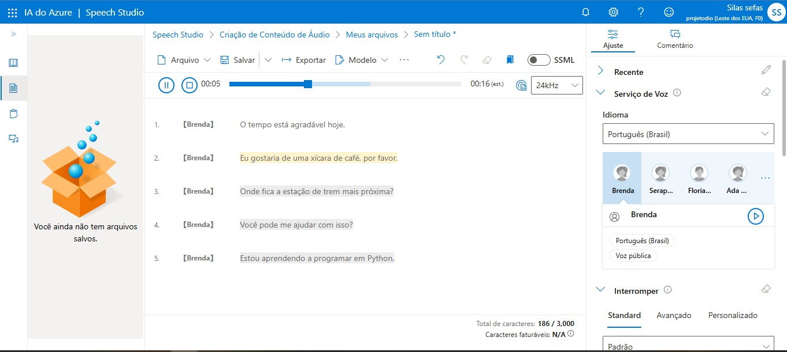
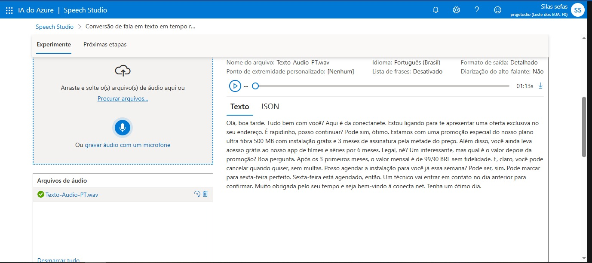

# 💬 Projeto de Processamento de Linguagem Natural com IA — Azure Speech & Language Studio

Este projeto demonstra o uso da **Inteligência Artificial da Microsoft Azure**, especificamente os serviços **Speech Studio** e **Language Studio**, aplicados ao **Processamento de Linguagem Natural (PLN)**.

A proposta é simples: fornecer frases ou comandos de voz e obter uma análise inteligente com base em emoções, intenções e contexto.

---

## 🧠 O que foi utilizado?

- **Azure Language Studio** → Para análise de sentimento, extração de entidades, classificação de intenção e mais.
- **Azure Speech Studio** → Para transcrição automática de voz para texto, e também testes de conversão de texto em fala (TTS).

---

## 🗂️ Estrutura do Projeto

```
PLN-Com-IA/
├── input/     → Frases e textos usados nos testes
├── output/    → Resultados gerados pelos serviços de IA
├── assets/    → Capturas de tela de cada etapa do processo
└── readme.md  → Este arquivo de documentação
```

---

## 👣 Como reproduzir os testes você mesmo

Você pode refazer todo o processo facilmente com sua conta gratuita do Azure:

### 🔹 1. Criar uma conta Azure
- Acesse: [https://azure.microsoft.com](https://azure.microsoft.com)
- Crie uma conta (tem créditos gratuitos)

### 🔹 2. Acessar os estúdios:
- **Language Studio:** [https://language.azure.com](https://language.azure.com)
- **Speech Studio:** [https://speech.microsoft.com](https://speech.microsoft.com)

### 🔹 3. No **Language Studio**:
- Vá em **"Análise de Texto" > "Explorar"**
- Escolha um modelo como:
  - Análise de sentimento
  - Extração de entidades nomeadas
  - Classificação de intenção
- Cole o texto desejado (ex: frases do arquivo `input/Inputs em Texto`)
- Visualize os resultados (salve em `output/analise-emocoes.txt`)

### 🔹 4. No **Speech Studio**:
- Acesse a seção de **Texto para Fala (Text to Speech)** para transformar qualquer frase em áudio
- Ou use **Fala para Texto (Speech to Text)** para transcrever sua própria gravação
- Teste frases como:
  - “Apagar a luz da sala”
  - “Criar um lembrete para amanhã às 8h”
  - “Agendar reunião com Ana na sexta”

---

## 🖼️ Prints do Processo

### 🗣️ Geração de Áudio a partir de Texto
A imagem abaixo mostra o uso do **Speech Studio** para gerar áudios em três idiomas (Português, Inglês e Coreano) a partir de um mesmo texto:

📁 Arquivos de saída:  
- `output/Texto-Audio-PT`  
- `output/Texto-Audio-EN`  
- `output/Texto-Audio-KO`  

📷 Print:


---

### 🎧 Transcrição de Áudio para Texto
Neste teste, um áudio enviado pelo usuário foi transcrito usando o **Speech to Text** do Azure.

📁 Áudio original: `input/Audio-Para-Transcricao`  
📁 Print da transcrição:  


📁 Resultado analisado no Language Studio:  
- `output/analise-emocoes.txt`

---

## ✨ Insights e Aplicações

Durante os testes, alguns **insights poderosos** surgiram:

### ☎️ Atendimento Inteligente em Call Centers
As tecnologias de PLN podem ser usadas para entender a intenção do cliente e responder com naturalidade, criando experiências mais humanas, rápidas e satisfatórias.

### 🏠 Gestão da Casa com Comando de Voz
Comando de voz já é realidade:
- “Apagar luz”
- “Criar timer para 15 minutos”
- “Marcar compromisso às 18h”
Isso torna o controle da casa simples e acessível.

### 💼 Auxílio no Trabalho
No ambiente profissional, a IA pode:
- Transcrever reuniões
- Criar resumos de e-mails
- Automatizar tarefas por comando de voz

### 🌍 Tradução Simultânea em Tempo Real
O avanço dos modelos de linguagem pode possibilitar tradução simultânea por dispositivos portáteis, eliminando a barreira de idiomas em viagens internacionais.

### 🤖 Comunicação Natural com IA
Estamos caminhando para um cenário onde conversar com uma IA será tão fluido quanto falar com alguém ao seu lado — em qualquer idioma e em qualquer lugar.

---

## 📌 Possibilidades Futuras

- Inclusão de chatbots com voz natural
- Análise de sentimentos em tempo real por áudio
- Criação de assistentes pessoais em português usando voz neural
- Integração com dispositivos físicos (como Alexa, Google Nest)

---

## ✅ Conclusão

Este projeto mostra como as ferramentas da **Azure IA** tornam o **PLN acessível, prático e poderoso**. Usando apenas recursos gratuitos da plataforma, conseguimos criar análises de linguagem, comandos por voz e interações realistas — aproximando cada vez mais o humano da máquina.

---

👨‍💻 *Desenvolvido como parte do conteúdo prático de IA aplicada à linguagem, por [Silas Sefas].*
